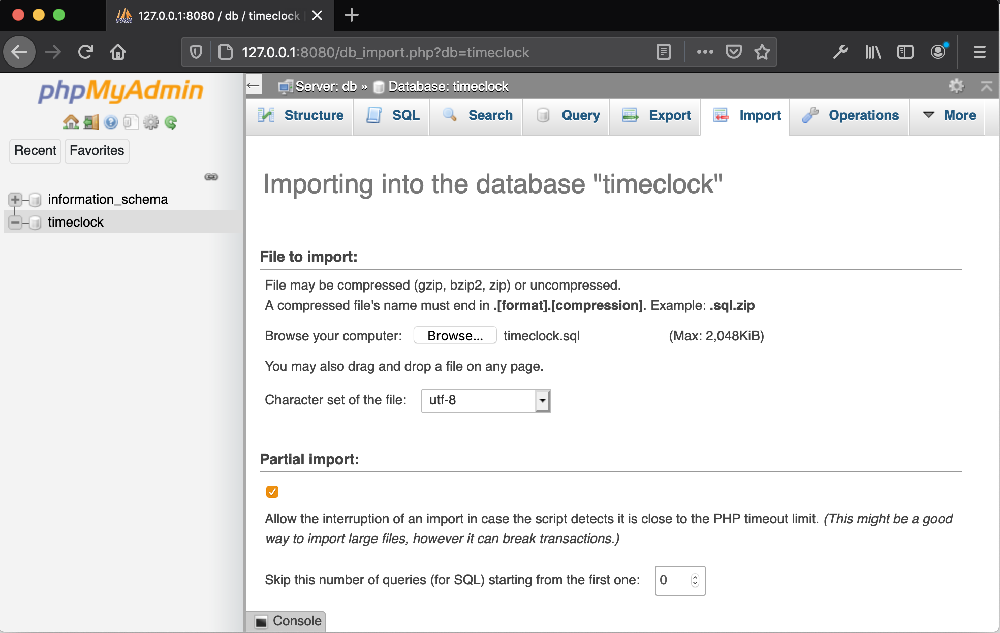
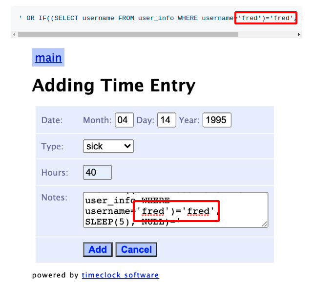
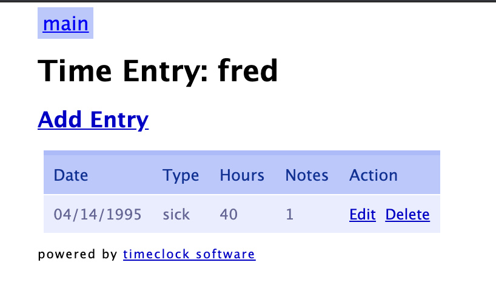

# TimeClock Software 1.01 Authenticated Time-Based SQL Injection   
> This report details a time-based SQL injection attack in the Employee Timeclock software, version 1.01.  

- [TimeClock Software 1.01 Authenticated Time-Based SQL Injection](#timeclock-software-101-authenticated-time-based-sql-injection)
- [Overview](#overview)
  - [About Authors](#about-authors)
  - [Navigating the Report](#navigating-the-report)
  - [About Timeclock](#about-timeclock)
  - [About the Vulnerability](#about-the-vulnerability)
- [Testing the POC](#testing-the-poc)
  - [Requirements](#requirements)
  - [Test Against Our Server](#test-against-our-server)
  - [Remote Testing](#remote-testing)
  - [Local Testing](#local-testing)
- [Running Docker on Remote Server](#running-docker-on-remote-server)
- [Creating Docker App from Source](#creating-docker-app-from-source)
- [Exploit Details](#exploit-details)


# Overview  
This report details a time-based SQL injection attack in the Employee Timeclock software, version 1.01. Included in the report are a exploit-db ready report, two dockerized timeclock 1.01 applications for testing (1 for remote and 1 for local), and this readme document.  

## About Authors  

This vulnerability was discovered by François Bibeau who also developed the proof of concept exploit. Additional support was provided by [Tyler Butler](https://tbutler.org) who developed the dockerized application and testing enviorment. 

## Navigating the Report  
A high level overview of the submission contents.

```bash
.
├── docker  # Dockerize timeclock 1.01 for remote testing
│   ├── db    
│   ├── docker-compose.yml  
│   └── timeclock  
├── docker-local  # Dockerize timeclock 1.01 for local testing
│   ├── db  
│   ├── docker-compose.yml  
│   └── timeclock  
├── PoC.py  # A PoC python script 
└── readme.md    
```

## About Timeclock

[Timeclock](http://timeclock-software.net/) is a employee time managment application managed by timeclock-software.net. According to the vendor's website,

> Timeclock-software.net's free software product will be a simple solution to allow your employees to record their time in one central location for easy access.    

The application uses php to enable employees to log working time by category, and includes administration options for admins to manage the app and employees. The download for version 1.01 includes a .sql file to create a database schema and populates it with default values

**Product Versions**

Timeclock's official website supports versions up to 1.01 which was released on 1-28-2016. It can be acquired through the [download page](http://timeclock-software.net/timeclock-download.php)

## About the Vulnerability   

The timeclock 1.01 application is vulnerable to a time-based slq injection in the add time option for regular users. This vulnerability allows an attacked to automate guessing of different database columns and tables to enumerate the entire database. The location of the vulnerabiliy is [app ip]/add_time.php. The exploit process works by passing queries to the database throught the SQLi on the notes section of add_time.php. If the query returns true, then a "1" will put in the notes. If the query returns false, then a "0" will be put in the notes.  

The PoC created to demonstrate the vulnerability guesses if several usernames exist in the database. Below is the payload. 


```python
payload = f"' OR IF((SELECT username FROM user_info WHERE username='{user}')='{user}', SLEEP(5), NULL)='"

```    

When running against a timeclock application, such as the dockerized app in this report or our remote testing server at http://159.203.41.34/add_entry.php, the default users Fred and Admin are found. 

# Testing the POC  
To validate the findings of this report, the timeclock 1.01 application was dockerized into two separate apps. The app in /docker is ported to expose port 80 to the internet and can be used for testing remotely over HTTP on a server. The app in /docker-local is ported to localhost:80 and can be used to test locally. Additionally the application is running at http://159.203.41.34/ for a limited time.

## Requirements  
Testing the exploit described in this report requires the use of docker, docker-compose, and python.

**[Docker](https://www.docker.com/)** 

*Installation on Linux*  

```bash
curl -fsSL https://get.docker.com -o get-docker.sh
```

```bash
sudo sh get-docker.sh
```

**[Docker-Compose](https://docs.docker.com/compose/)**

*Installation on Linux*

Download binaries via curl
```bash
sudo curl -L "https://github.com/docker/compose/releases/download/1.26.2/docker-compose-$(uname -s)-$(uname -m)" -o /usr/local/bin/docker-compose
``` 

Make binaries executable
```bash
sudo chmod +x /usr/local/bin/docker-compose
```  

**[Python3](https://www.python.org/)**

*Installation on  Linux*    

```bash
sudo apt-get install python3.6
```

## Test Against Our Server   
For a limited time, we are running a dockerized timeclock 1.01 on a remote digital ocean server. If you'd like to access the applicaiton, go to http://159.203.41.34/.  

**Run the PoC**
To test the findings, simply run the PoC which is by default pointed at this testing server.  

```bash
python3 PoC.py
```  


## Remote Testing 
/docker contains a dockerized timeclock 1.01 application that exposes port 80 of the container to port 80 of the host. If this is run on a remote server such as a digital ocean droplet, then this will be publically available through http://[ip of server]:80

**Clone the repository**

```bash
git clone https://github.com/tcbutler320/timeclock-vuln.git
```

**CD into Docker**

```bash
cd /timeclock-vuln/docker
```

**Run the app**

```bash
docker-compose up -d
```

**Browse timeclock**
In your browser, visit http://[ip of server]  

**Running the PoC**

Run the PoC python appplication against the remote timeclock app with the following. Make sure to change the target ip to the ip of the application your testing against.  

```python
python3 PoC.py
``` 

The output shows the admin and fred user were found.  


## Local Testing     
*/docker-local contains a dockerized timeclock 1.01 application that only runs locally on 127.0.0.1:80 on the host. 

**Clone the repository**

```bash
git clone https://github.com/tcbutler320/timeclock-vuln.git
```  

**CD into Docker-Local**

```bash
cd /timeclock-vuln/docker-local
```  

**Run the app**

```bash
docker-compose up -d
```

**Browse timeclock** 
In your browser, visit http://127.0.0.1

**Testing the PoC**

To test the PoC against a local docker container, change the target to 127.0.0.1


```python
login_url = 'http://127.0.0.1/login_action.php' 
```  

Run the PoC with the following command   

```bash
python3 PoC.py
```

# Running Docker on Remote Server   
The following steps were used to replicate the exploit on a digital ocean droplet.  

**Spin up a server**
For information on setting up a droplet on digital ocean, see [How to Create a Droplet from the DigitalOcean Control Panel](https://www.digitalocean.com/docs/droplets/how-to/create/).  For information on installing docker on ubunto, see [Install Docker Engine on Ubuntu
](https://docs.docker.com/engine/install/ubuntu/)

**Download Docker Installation Script** 

```bash
curl -fsSL https://get.docker.com -o get-docker.sh
```

**Install Docker** 

```bash
sudo sh get-docker.sh
```  

**Install Dockerized Timeclock**  
See [Remote Testing](#remote-testing) for instructions for installing the POC docker application for remote testing  


# Creating Docker App from Source 
The following instructions detail how to create your own docker application from the timeclock source files 

**Create Folder Structure**   

```bash
mkdir docker
mkdir /docker/db/
mkdir /docker/timeclock
``` 

**Download Source Files**  
Download version 1.01 from the [download page](http://timeclock-software.net/timeclock-download.php). Unzip the file and place files inside docker folder at /docker/timeclock.


**Create Docker-Compose**  

Make a new docker-compose.yml file at the root of the /docker folder with the following information.

```yml
version: '3.2'
services:
    php-apache:
        depends_on:
            - db
        build:
          context: ./timeclock
        ports:
            - 80:80
        volumes:
            - ./timeclock:/var/www/html
        links:
            - 'db'
    db:
      image: mysql:5.7
      volumes:
          - ./db:/var/lib/mysql
      environment:
          MYSQL_ROOT_PASSWORD: "rootpwd"
          MYSQL_USER: 'devuser'
          MYSQL_PASSWORD: 'devpass'
          MYSQL_DATABASE: 'timeclock'
    phpmyadmin:
      depends_on:
        - db
      image: phpmyadmin/phpmyadmin
      container_name: phpmyadmin
      restart: always
      ports:
        - 8080:80
      environment:
        PMA_HOST: db
volumes:
  db:
```

**Create a Dockerfile**  

In the /timeclock folder, create a file called Dockerfile. In it, put the following information.  

```yml
FROM php:7.2.1-apache
RUN docker-php-ext-install pdo pdo_mysql mysqli
```
**Add DB Information**

In the /timeclock folder, edit the db.php file to reference your database. Change the following lines to reference the dockerized db. 

```php
/** the name of the database */
$db_name = "timeclock";

/** mysql database username */
$db_user = "devuser";

/** mysql database password */
$db_password = "devpass";

/** mysql hostname */
$db_host = "db";
```

**Start Application**

```bash
docker-compose up -d
```

**Log into phpmyadmin** 

In your browser, go to 127.0.0.1:8080. The log in credentials for phpmyadmin are devuser;devpass. On the left hand-side, select the timeclock database.  

**Import the timeclock database** 

At the top of the timeclock db page, select "import". On the pop-up file explorer, select the timeclock.sql file downloaded from the vendor. Once selected, select "go" at the bottom. 



**Log into Timeclock Application**

The timeclock app has now been dockerized from source. To log in, go to 127.0.0.1:80 in your browser. The default credentials are Admin:admin and Fred:fred. 


# Exploit Details  

The PoC works by exploiting the time-based sqli to query the database in true/false queries. The following payload is used to ask if a certain user exists. 


```sql 
' OR IF((SELECT username FROM user_info WHERE username='{user}')='{user}', SLEEP(5), NULL)='
```    


Upon execution the application will hang for the sleep time. When it finisheds, you will notice a "1" in the notes feild. This indicates that the user was found. Should you test with a different username, you will notice a "0", indicating that no user was found.     


The image below shows a manual test of the PoC, where the username 'fred' is being tested.   





As you can see below, the response of "1" means the user was found.





